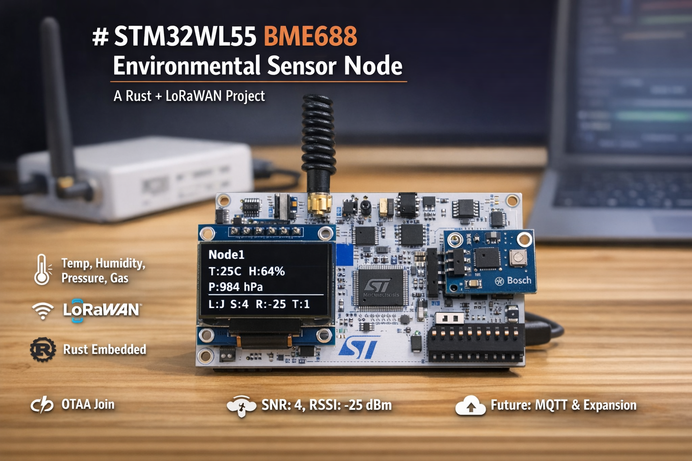

# STM32WL55 BME688 Environmental Sensor Node

A Rust embedded project for the STM32WL55JC microcontroller that reads environmental data from a BME688 sensor and displays it on an OLED screen. This is Node 1 of a LoRaWAN sensor network.



## Project Purpose

This project serves as a **foundation and validation platform** for a larger sensor network system. The primary objectives are:

1. **Validate LoRaWAN Gateway Connectivity**: Ensure reliable communication between the STM32WL55 device and the LoRaWAN gateway, including:

   - Successful OTAA (Over-The-Air Activation) join process
   - Reliable data transmission and reception
   - SNR/RSSI monitoring for link quality assessment
   - Error handling and recovery mechanisms

2. **Hardware Integration Testing**: Verify proper integration of all hardware components:

   - BME688 environmental sensor (I2C communication)
   - SH1106 OLED display (I2C communication)
   - SubGHz radio (SPI communication)
   - RF switch control for antenna routing

3. **Software Stack Validation**: Test and validate the embedded software stack:

   - Embassy async framework integration
   - LoRaWAN device stack (lorawan-device)
   - LoRa physical layer (lora-phy)
   - I2C bus sharing between sensor and display
   - Radio interference mitigation strategies

4. **Foundation for Expansion**: Establish a working baseline that can be extended with:
   - MQTT integration for cloud connectivity
   - Additional sensor nodes
   - Advanced data processing
   - Power optimization
   - Remote configuration and updates

This validation phase ensures that the core connectivity and hardware integration are solid before building out the full sensor network infrastructure.

## Features

- **BME688 Sensor Integration**: Reads temperature, humidity, pressure, and gas resistance
- **Gas Sensor**: Metal-oxide gas sensor with configurable heating profiles
- **OLED Display**: SH1106 128x64 OLED display via I2C
- **Embassy Async Framework**: Modern async/await embedded programming
- **Integer-Only Math**: No floating point operations required
- **I2C Bus Scanning**: Automatic device detection and validation
- **LoRaWAN Integration**: Full LoRaWAN device stack with OTAA join support
- **RF Switch Control**: Automatic antenna routing for NUCLEO-WL55JC1 board
- **AU915 Region**: Configured for Australia 915 MHz frequency band

## Hardware

### Microcontroller

- **STM32WL55JC** (Cortex-M4 core)
- Dual-core processor (M4 + M0+), this project uses M4 core

### LoRaWAN Gateway

- **WisGate Edge Lite 2 (RAK7268V2)**
- **Region**: AU915 (Australia 915 MHz frequency band)
- **Configuration**: Configured to receive and forward LoRaWAN packets from this device
- **Network Server**: Connected to LoRaWAN network server for device management and data forwarding

### Peripherals

- **I2C2 Bus**:
  - SCL: PA12
  - SDA: PA11
  - Speed: 100 kHz
- **BME688 Sensor**: I2C address 0x76 (default) or 0x77
- **SH1106 OLED Display**: I2C address 0x3C
- **LED**: PB15 (status indicator)

## Software Stack

- **Embassy**: Async embedded framework
- **defmt**: Efficient logging framework
- **embedded-graphics**: Graphics primitives for display
- **sh1106**: OLED display driver
- **panic-probe**: Panic handler with defmt support
- **lorawan-device**: LoRaWAN device stack (v0.12)
- **lora-phy**: LoRa physical layer (v3.0)

## Initial Setup

### Security Configuration (Required for SubGHz Radio)

**IMPORTANT**: STM32WL55 boards come with security enabled by default, which blocks SubGHz radio access. You must disable security before using the radio.

Run the security configuration script:

```bash
./disable_security.sh
```

This script uses STM32CubeProgrammer to disable:

- **SPI3 security** (required for SubGHz radio access)
- Read/Write protection
- Boot locks

**Prerequisites:**

- STM32CubeProgrammer installed
- Board connected via USB

See `SECURITY_SETUP.md` for detailed instructions and troubleshooting.

### RF Switch Configuration (Automatic)

The NUCLEO-WL55JC1 board includes an RF switch that routes signals to/from the antenna. This is **automatically configured** by the radio driver:

- **TX Mode**: RF switch set to High Power before transmission
- **RX Mode**: RF switch set to RX before reception
- **OFF Mode**: RF switch turned off after TX/RX to reduce interference

**GPIO Pins Used**: PC3, PC4, PC5

If the gateway is not receiving packets, verify the RF switch is being configured (check logs for "RF switch initialized").

## Building

### Prerequisites

- Rust toolchain (latest stable)
- `probe-rs` for flashing
- `thumbv7em-none-eabihf` target
- **Security disabled** (see Initial Setup above)

### Setup

```bash
# Install target
rustup target add thumbv7em-none-eabihf

# Install probe-rs (if not already installed)
cargo install probe-rs --locked

# Build and flash
cargo run --release
```

### Build Profiles

- **Release**: Optimized for size (`opt-level = "z"`), includes debug symbols
- **Dev**: Optimized for development (`opt-level = 1`)

## Usage

1. Connect hardware:

   - BME688 sensor to I2C2 (PA11/PA12)
   - SH1106 OLED display to I2C2 (PA11/PA12)
   - LED on PB15 (optional)

2. Flash firmware:

   ```bash
   cargo run --release
   ```

3. Monitor output:
   - Use `probe-rs` RTT viewer or serial monitor
   - Output includes sensor readings and I2C bus status

## Display Output

The OLED displays:

- **Line 1**: "Node1" (title)
- **Line 2**: Temperature and Humidity (compact format: "T:25C H:64%")
- **Line 3**: Pressure ("P:984 hPa")
- **Line 4**: Gas Resistance ("G:512")
- **Line 5**: LoRaWAN Status
  - When joined: "L:J S:4 R:-25 T:1" (Joined, SNR, RSSI, TX count)
  - When not joined: "L:NotJoined"

## Sensor Readings

- **Temperature Range**: -40°C to +85°C
- **Humidity Range**: 0% to 100% RH
- **Pressure Range**: 300 to 1100 hPa
- **Gas Resistance**: 10-bit raw value (0-1023), requires calibration for kΩ conversion
  - Typical clean air: 10-500 kΩ (after proper calibration)
  - Lower values indicate higher gas concentration

## Project Structure

```
lora_1/
├── src/
│   └── main.rs          # Main application code
├── Cargo.toml           # Dependencies and build config
├── memory.x             # Memory layout definition
├── build.rs             # Build script
├── README.md            # This file
├── NOTES.md             # Development notes
└── TROUBLESHOOTING.md   # Troubleshooting guide
```

## I2C Device Addresses

- **BME688**: 0x76 (primary) or 0x77 (secondary)
- **SH1106 OLED**: 0x3C

## Conversion Formulas

The project uses simplified integer-only conversion formulas:

- **Temperature**: `temp_raw / 1290` (°C)
- **Humidity**: `hum_raw / 285` (% RH, clamped 0-100%)
- **Pressure**: `(press_raw * 9) / 2` (Pa)
- **Gas Resistance**: Raw 10-bit value (0-1023), displayed as-is
  - Proper conversion to kΩ requires calibration coefficients from sensor registers
  - Formula: `gas_kohm = gas_raw * calibration_factor` (coefficients needed)

**Note**: These are empirically derived formulas. For production use, read and apply calibration coefficients from the BME688 sensor registers for maximum accuracy.

## LoRaWAN Status

**Current State**: ✅ **FULLY FUNCTIONAL**

- ✅ LoRaWAN credentials configured (AU915 region, 915 MHz)
- ✅ SubGHz radio driver implemented (lora-phy with SX126x)
- ✅ RF switch control (automatic TX/RX routing)
- ✅ LoRaWAN stack initialized (lorawan-device)
- ✅ OTAA join process working
- ✅ Data transmission every 60 seconds
- ✅ SNR/RSSI tracking and display
- ✅ TX counter tracking

**Gateway**: WisGate Edge Lite 2 (RAK7268V2) - AU915

**Credentials** (AU915):

- Device EUI: `AC1F09FFFE1BCE23`
- Application EUI: `b130a864c5295356`
- Application Key: `b726739b78ec4b9e9234e5d35ea9681b`

## Documentation

For complete project documentation, see:

- **PROJECT_DOCUMENTATION.md** - Comprehensive technical documentation
- **NOTES.md** - Development notes and findings
- **TROUBLESHOOTING.md** - Common issues and solutions
- **SECURITY_SETUP.md** - Security configuration instructions
- **LORAWAN_INTEGRATION.md** - LoRaWAN integration details

## Current Status

✅ **All Core Features Working**:

- BME688 sensor reading (temperature, humidity, pressure, gas)
- OLED display with real-time updates
- LoRaWAN OTAA join
- Data transmission every 60 seconds
- SNR/RSSI display
- TX counter tracking
- Error recovery and retry logic

## Future Enhancements

- [ ] MQTT integration (next step)
- [ ] Gas sensor calibration coefficient reading and application
- [ ] IAQ (Indoor Air Quality) calculation from gas resistance
- [ ] Multiple gas sensor heating profiles
- [ ] Data logging to flash
- [ ] Low-power modes

## License

## Contributing
